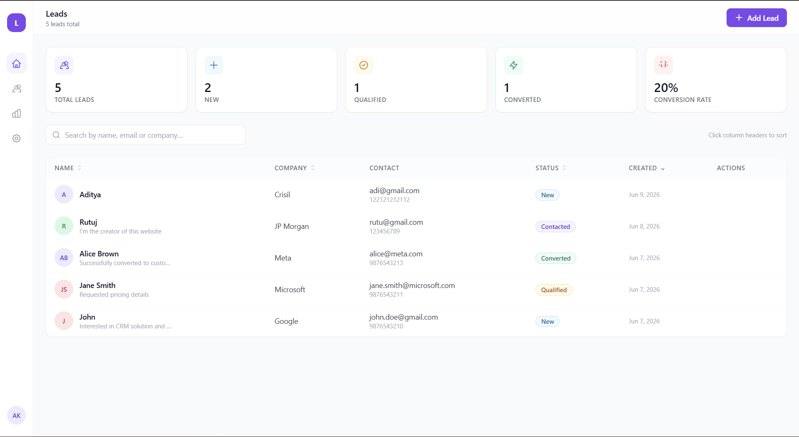
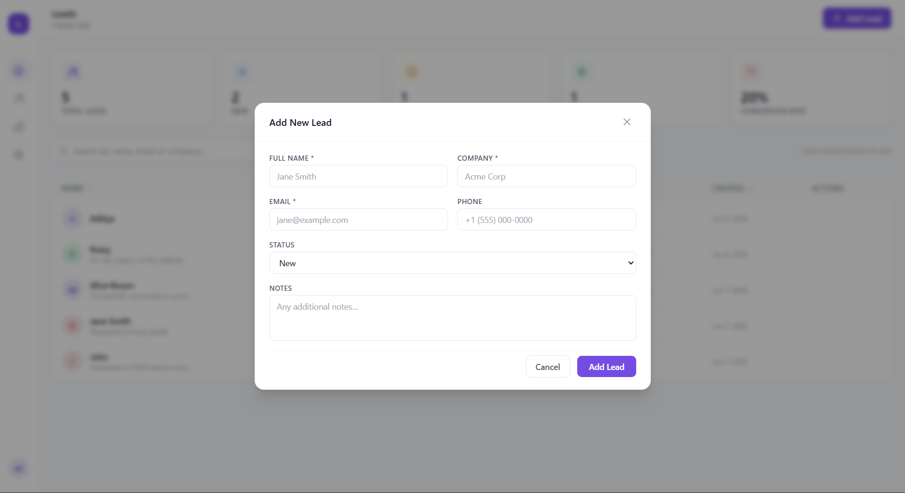

# Lead Management CRM

A modern full-stack Lead Management CRM built with React, Express.js, MongoDB Atlas, and Tailwind CSS. The application enables users to create, manage, update, delete, and search leads through a responsive dashboard interface.

## Features

* Create new leads
* View all leads
* Update lead information
* Delete leads
* Search leads by name, email, or company
* Real-time MongoDB persistence
* Responsive dashboard UI
* Lead status tracking
* Environment variable configuration

## Tech Stack

### Frontend

* React
* Vite
* Tailwind CSS
* JavaScript (ES6+)

### Backend

* Node.js
* Express.js
* MongoDB Atlas
* Mongoose

## Project Structure

```text
lead-management-crm/
│
├── backend/
│   ├── config/
│   ├── controllers/
│   ├── models/
│   ├── routes/
│   ├── server.js
│   └── package.json
│
├── frontend/
│   ├── src/
│   │   ├── api/
│   │   ├── components/
│   │   ├── constants/
│   │   ├── hooks/
│   │   └── App.jsx
│   └── package.json
│
└── README.md
```

## API Endpoints

| Method | Endpoint                       | Description   |
| ------ | ------------------------------ | ------------- |
| GET    | `/api/leads`                   | Get all leads |
| POST   | `/api/leads`                   | Create a lead |
| PUT    | `/api/leads/:id`               | Update a lead |
| DELETE | `/api/leads/:id`               | Delete a lead |
| GET    | `/api/leads/search?term=value` | Search leads  |

## Environment Variables

### Backend (.env)

```env
MONGO_URI=your_mongodb_connection_string
PORT=5000
```

### Frontend (.env)

```env
VITE_API_URL=http://localhost:5000
```

## Installation

### Clone Repository

```bash
git clone https://github.com/surverutuj68-glitch/lead-management-crm.git
cd lead-management-crm
```

### Backend Setup

```bash
cd backend
npm install
npm run dev
```

### Frontend Setup

```bash
cd frontend
npm install
npm run dev
```

## Usage

1. Start the backend server.
2. Start the frontend application.
3. Open the application in your browser.
4. Create, update, delete, and search leads through the dashboard.

## Screenshots

### Dashboard



### Add Lead



### Search Lead


## Future Improvements

* Authentication & Authorization
* Pagination
* Lead filtering by status
* Dashboard analytics
* Activity history tracking
* Export leads to CSV/Excel
* Role-based access control

## Author

**Rutuj**

Built as a full-stack CRM project using React, Express.js, and MongoDB Atlas.
